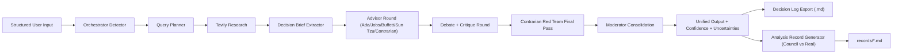

# Council of Minds Architecture

## Goals

- Separate facts from interpretation
- Make prompt selection scenario-aware
- Ground reasoning with external evidence
- Produce consistent, auditable decision outputs

## System Flow

## Orchestration Layer (LangGraph)

Implemented in [lib/meeting.ts](/Users/dorangao/study/council-of-minds/lib/meeting.ts).

State graph nodes:

1. `detect_scenario`
2. `run_research`
3. `prepare_brief`
4. `advisor_answers`
5. `debate_round`
6. `contrarian_round`
7. `consolidate`

This makes the pipeline explicit and easy to extend (add nodes, branching, guardrails).

## Scenario Detector / Prompt Router

Implemented in [lib/orchestrator.ts](/Users/dorangao/study/council-of-minds/lib/orchestrator.ts).

Routing output (`ScenarioPlan`):

- `type`:
  - `ai_layoff_decision`
  - `build_vs_buy`
  - `product_strategy`
  - `cost_optimization`
  - `risk_compliance`
  - `general_decision`
- `rationale`
- `advisorAddendum`
- `moderatorAddendum`
- `suggestedQueries`

Selection strategy:

1. Heuristic pass (fast deterministic keyword routing)
2. LLM classifier pass (JSON output)
3. Fallback to heuristic if parsing/model call fails

## Research Layer (Tavily)

Implemented in [lib/research.ts](/Users/dorangao/study/council-of-minds/lib/research.ts).

- Input: up to 4 orchestrator-generated queries
- Output:
  - per-query summary (`answer`)
  - source list (`title`, `url`, `content`, optional `score`)
- If `TAVILY_API_KEY` is absent or a request fails, pipeline continues with empty research.

## Prompting Layers

- Brief extraction: [lib/prep.ts](/Users/dorangao/study/council-of-minds/lib/prep.ts)
  - Uses structured input + scenario + research
  - Produces canonical brief sections

- Advisors and critiques: [lib/meeting.ts](/Users/dorangao/study/council-of-minds/lib/meeting.ts)
  - Persona base prompt + scenario addendum + evidence context

- Moderator: [lib/consolidate.ts](/Users/dorangao/study/council-of-minds/lib/consolidate.ts)
  - Produces recommendation, options, scorecard, memo, hedge plan, next steps
  - Adds `Confidence: <n>/100` and `KEY UNCERTAINTIES`

## Interfaces and Data Contracts

Types are centralized in [lib/types.ts](/Users/dorangao/study/council-of-minds/lib/types.ts).

Primary models:

- `MeetingInput`
- `ScenarioPlan`
- `ResearchResult`
- `PersonaResult`
- `MeetingRunResult`

## APIs

- [app/api/meeting/route.ts](/Users/dorangao/study/council-of-minds/app/api/meeting/route.ts)
  - Entry point for running the full orchestrated workflow

- [app/api/decision-log/route.ts](/Users/dorangao/study/council-of-minds/app/api/decision-log/route.ts)
  - Exports enriched markdown decision memo

- [app/api/analysis-record/route.ts](/Users/dorangao/study/council-of-minds/app/api/analysis-record/route.ts)
  - Builds comparison-ready markdown record (Council recommendation vs real-world decision)

## UI Layer

Implemented in [app/page.tsx](/Users/dorangao/study/council-of-minds/app/page.tsx):

- Structured input sections:
  - Question
  - Context (facts)
  - Decision criteria
  - Assumptions
  - Risks
- Displays:
  - Scenario routing
  - Tavily evidence
  - Confidence + uncertainties
  - Advisor/contrarian output
  - Unified moderator recommendation

## Extension Points

1. Add new scenario type in `SCENARIO_LIBRARY` with dedicated query templates.
2. Add domain-specific advisor personas (e.g., Legal, Security, GTM).
3. Add strict JSON outputs for scorecards and confidence calibration.
4. Add memory/history for decision comparisons over time.
5. Add evaluation harness for “real decision vs council decision” benchmarking.

## Decision Intelligence Storage

Repository folders:

- [decisions](/Users/dorangao/study/council-of-minds/decisions): baseline decision metadata
- [records](/Users/dorangao/study/council-of-minds/records): generated analysis records
- [evidence](/Users/dorangao/study/council-of-minds/evidence): supporting source materials
